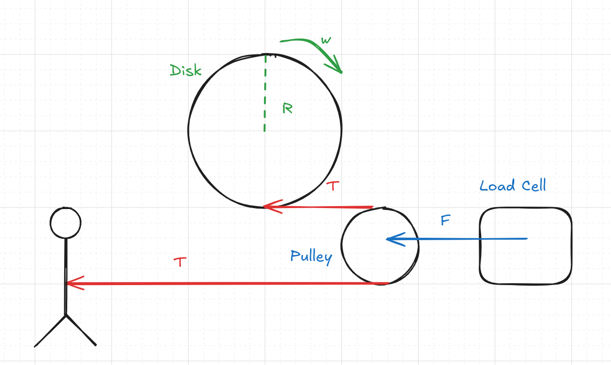

In this system, we have a brushless motor controlled by a velocity control board where the user can specify an analog voltage between 1.5 and 4 V to control the speed. The motor is attached to a 32:1 gearbox which is in turn connected to a disk of radius R and mass M. Around the disk, there is a string of negligible mass that rotates with the disk. The string passes over a pulley, which is attached to a load cell, and then is attached to a person walking towards the motor. We want to apply a set force F to the person walking towards the motor. 

Motor Specifications:

Load Cell Specifications:
- SMA-900N
- Capacity: 900 N
- Serial Number: 181440

Strain Gauge Amplifier Specifications:
- Current Settings:
  - Output range: +/- 10V
  - Excitation voltage: 10V
  - Gain: 
    - Currently set to 2.63 mv/V
    - Load cell nominal sensitivity: 2.5 mV/V
  - Filter: 500 Hz